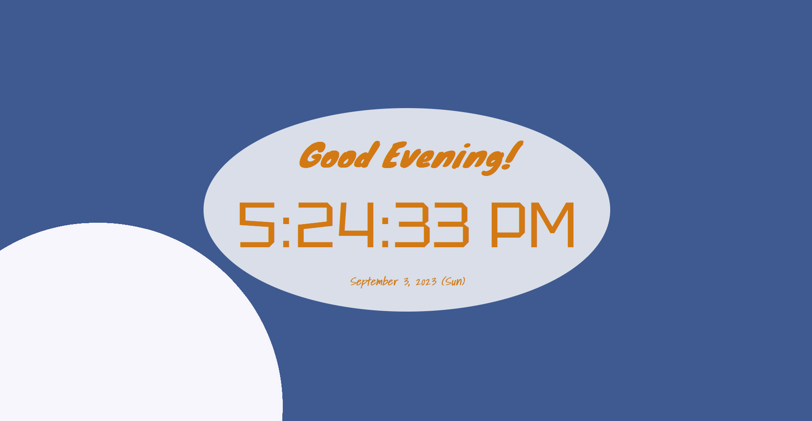
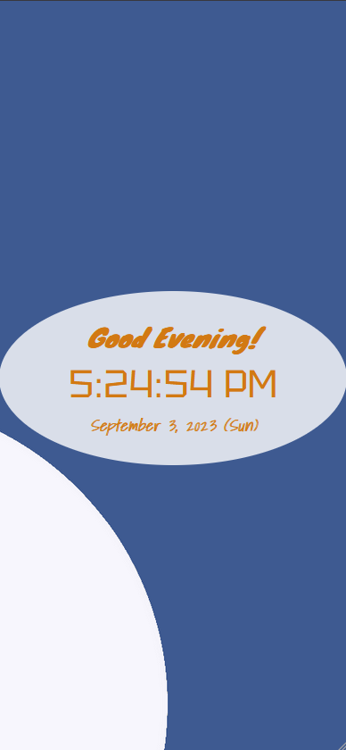

# Clock Program

That's a simple web clock program, by which it's possible to know date and time. There are some really simple art representing the current part of day (morning, afternoon, evening and night) on background, as well as a greeting. It's made with HTML, CSS and JavaScript.

#### Examples

- PC-like screen:

- Phone-like screen:

## Contributing

Anyone can contribute to it with issues and pull requests, even thought there's not much features to add (it's just a clock with some style).

## Usage

The program can be accessed by downloading all the files and opening index.html in a browser.

## Author

#### João Vitor Sobral

Github: sobraljvss  
Contact: sobraljvss@gmail.com

## Credits

The images (including icon) were also made by João Vitor Sobral.

Credits to [Tyler Finck](https://fonts.google.com/query=Tyler+Finck), [Adam Jagosz](https://fonts.google.com/query=Adam+Jagosz) and [Kimberly Geswein](https://fonts.google.com/query=Kimberly+Geswein) for the fonts. All of them were taken from [Google Fonts](https://fonts.google.com/).